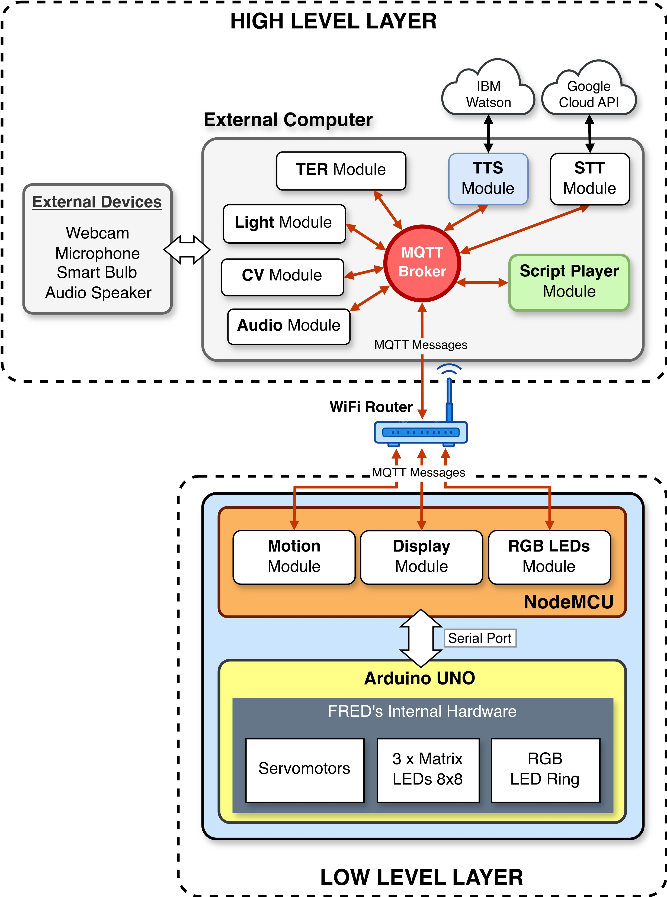

# FRED - Friendly Robot for EDucation and Healthcare
## FRED's Arduino Control Software

A arquitetura de software do robô FRED pode ser dividida em duas camadas, de alto nível e de baixo nível. A camada de baixo nível é implementada nas placas Arduino UNO e ESP8266 (NodeMCU) que ficam dentro do robô. O software de controle dessa camada é dividido nessas duas placas. O software que roda na placa Arduino é o responsável pelo controle e pela comunicação com os atuadores do robô, como: as três matrizes de leds, que representam a expressão facial do robô, a fita de leds RGB no tórax do robô e os quatro servomotores que compõem as pernas e os pés do FRED.
  

   
<strong>Figure 2.</strong> FRED Robot - Software Archtecture (LAYERS).
