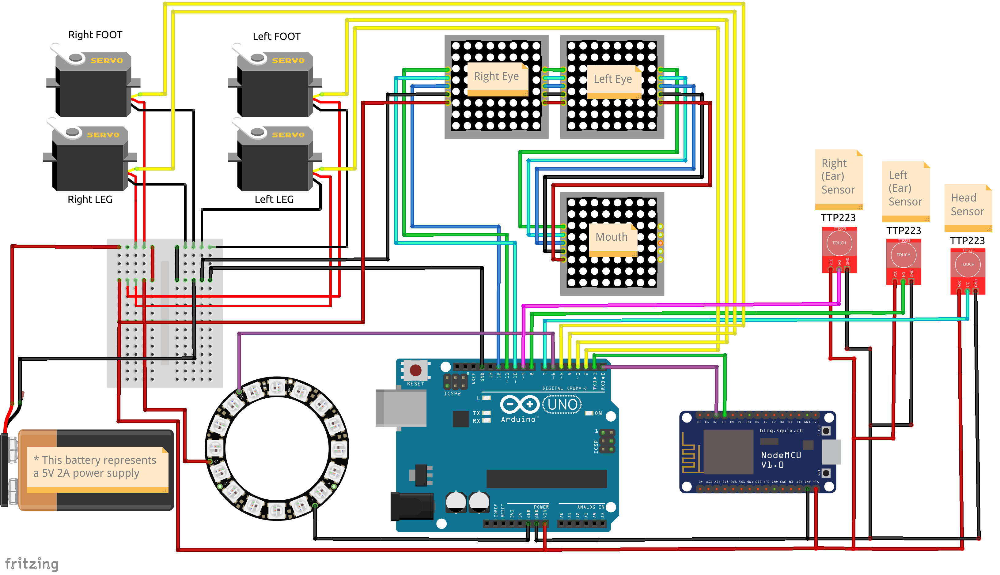

# FRED - Friendly Robot for EDucation and Healthcare
## Arduino Electronic Schema

Figure 1 shows the connection diagram for the FRED hardware components using jumper wires and a mini protoboard. The battery shown in the figure represents the 5V power supply with a minimum current capacity of 2A. All power for the FRED internal hardware system is supplied by this power supply. The diagram shown in the figure shows that the 8x8 LED arrays that make up the robot's display are connected in cascade (in series). The information for the LEDs in each array is sent through a multiplexing process, preventing the need for multiple Arduino ports to control the robot's display. The same happens with the ring of 16 RGB LEDs, whose LEDs are individually controlled by just one port on the Arduino board.

The figure also shows the 4 servomotors with the indication of each one, whether it is on the left or right leg or whether it is on the right or left foot.

**For testing purposes only**, initially, just to test the firmware and connections, the power can come directly from the Arduino's 5V pin, with the Arduino connected to the computer's USB port.

 

  
<strong>Figure 1.</strong> FRED Robot - Arduino Board Schema

